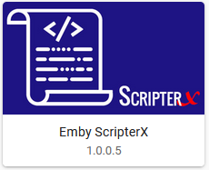
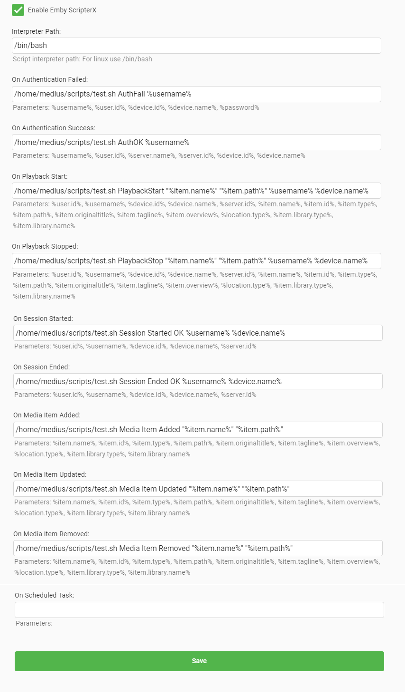
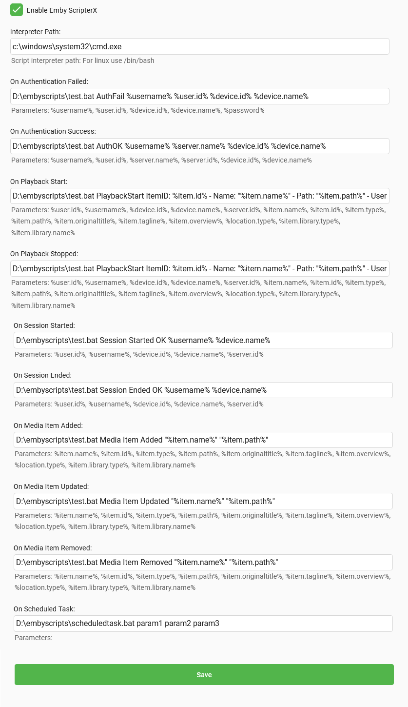

# Emby-ScripterX

Run custom external application or script (batch/bash) on various events within the Emby Server.  

## Installation
To install Emby-ScripterX, simply copy the Emby-ScripterX.dll to your plugin directory and restart your Emby Server.   This plugin supports Windows and Linux based installations.

## Configuration

### Linux

#### Interpreter Path
the path of the bash interpreter on your system, usually /bin/bash

### Windows

#### Interpreter Path
the path of the running executable for your scripts.  If you're using batch files, this should point to your commandline executable, for example c:\windows\system32\cmd.exe

### Supported Events

Event | Tokens Available
----- | ----------------
On Authentication Failed | %username%, %user.id%, %device.id%, %device.name%, %password% 
On Authentication Success | %username%, %user.id%, %server.name%, %server.id%, %device.id%, %device.name% 
On Playback Start | %user.id%, %username%, %device.id%, %device.name%, %server.id%,%item.name%, %item.id%, %item.type%, %item.path%, %item.originaltitle%, %item.tagline%, %item.overview%, %location.type%, %item.library.type%, %item.library.name%, %series.id%, %series.name%, %season.id%, %season.name%
On Playback Stopped | %user.id%, %username%, %device.id%, %device.name%, %server.id%, %item.name%, %item.id%, %item.type%, %item.path%, %item.originaltitle%, %item.tagline%, %item.overview%, %location.type%, %item.library.type%, %item.library.name%, %series.id%, %series.name%, %season.id%, %season.name%
On Session Started | %user.id%, %username%, %device.id%, %device.name%, %server.id% 
On Session Ended | %user.id%, %username%, %device.id%, %device.name%, %server.id% 
On Media Item Added | %item.name%, %item.id%, %item.type%, %item.path%, %item.originaltitle%, %item.tagline%, %item.overview%, %location.type%, %item.library.type%, %item.library.name%, %series.id%, %series.name%, %season.id%, %season.name%
On Media Item Updated | %item.name%, %item.id%, %item.type%, %item.path%, %item.originaltitle%, %item.tagline%, %item.overview%, %location.type%, %item.library.type%, %item.library.name%, %series.id%, %series.name%, %season.id%, %season.name%
On Media Item Removed | %item.name%, %item.id%, %item.type%, %item.path%, %item.originaltitle%, %item.tagline%, %item.overview%, %location.type%, %item.library.type%, %item.library.name%, %series.id%, %series.name%, %season.id%, %season.name%
On Scheduled Task | No tokens available yet

Note: %series.id%, %series.name%, %season.id%, %season.name% only available if media type is Episode.

### Example Usecases

When a user plays a media file, On Playback Start is executed.  This example (on linux) executes my bash script located at /home/medius/scripts/test.sh, supplying the script with the arguments/parameters 'PlaybackStart "%item.name%" "%item.path%" %username% %device.name%'

/home/medius/scripts/test.sh PlaybackStart "%item.name%" "%item.path%" %username% %device.name%

test.sh contains the following script:

#!/bin/bash
echo $@ >> /home/medius/scripts/scriptx.log

which outputs text to scriptx.log:

PlaybackStart Family Guy Presents Stewie Griffin: The Untold Story /home/medius/media/Movies/Stewie Griffin - The untold story.avi Anthony Firefox
