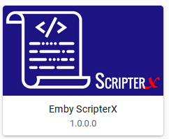

# Emby-ScripterX

Run custom external application or script (batch/bash) on various events within the Emby Server.  

## Installation
To install Emby-ScripterX, simply copy the Emby-ScripterX.dll to your plugin directory and restart your Emby Server.   This plugin supports Windows and Linux based installations.

## Configuration

### Linux

#### Interpreter Path
the path of the bash interpreter on your system, usually /bin/bash

### Windows

#### Interpreter Path
the path of the running executable for your scripts.  If you're using batch files, this should point to your commandline executable, for example c:\windows\system32\cmd.exe

### Supported Events

Event | Tokens Available
----- | ----------------
On Authentication Failed | %username%, %user.id%, %device.id%, %device.name%, %password% 
On Authentication Success | %username%, %user.id%, %server.name%, %server.id%, %device.id%, %device.name% 
On Playback Start | %user.id%, %username%, %device.id%, %device.name%, %server.id%, %item.id%, %item.path%, %item.album, %item.albumid%, %item.mediatype%, %item.originaltitle%, %item.tagline%, %item.overview% 
On Playback Stopped | %user.id%, %username%, %device.id%, %device.name%, %server.id%, %item.id%, %item.path%, %item.album, %item.albumid%, %item.mediatype%, %item.originaltitle%, %item.tagline%, %item.overview% 
On Session Started | %user.id%, %username%, %device.id%, %device.name%, %server.id% 
On Session Ended | %user.id%, %username%, %device.id%, %device.name%, %server.id% 
On Media Item Added | %item.id%, %item.path%, %item.album, %item.albumid%, %item.mediatype%, %item.originaltitle%, %item.tagline%, %item.overview% 
On Media Item Updated | %item.id%, %item.path%, %item.album, %item.albumid%, %item.mediatype%, %item.originaltitle%, %item.tagline%, %item.overview% 
On Media Item Removed | %item.id%, %item.path%, %item.album, %item.albumid%, %item.mediatype%, %item.originaltitle%, %item.tagline%, %item.overview% 

