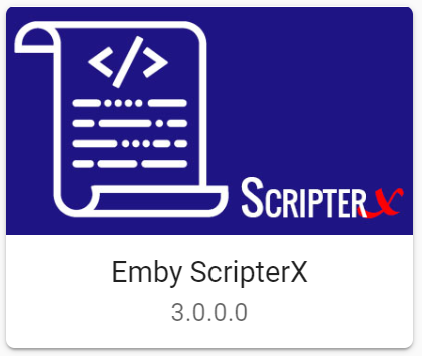
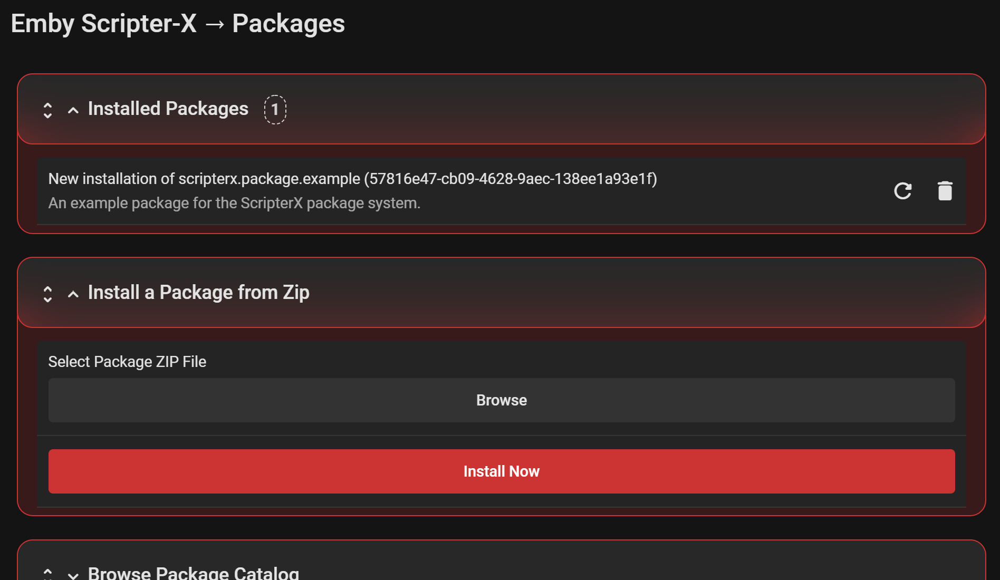
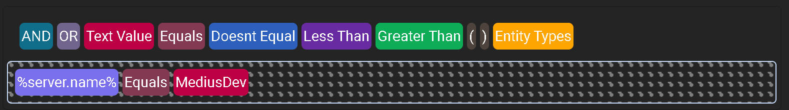
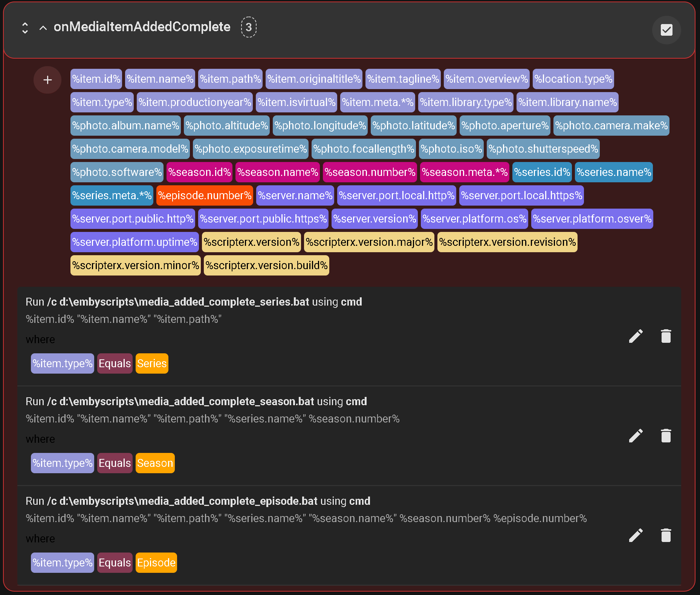
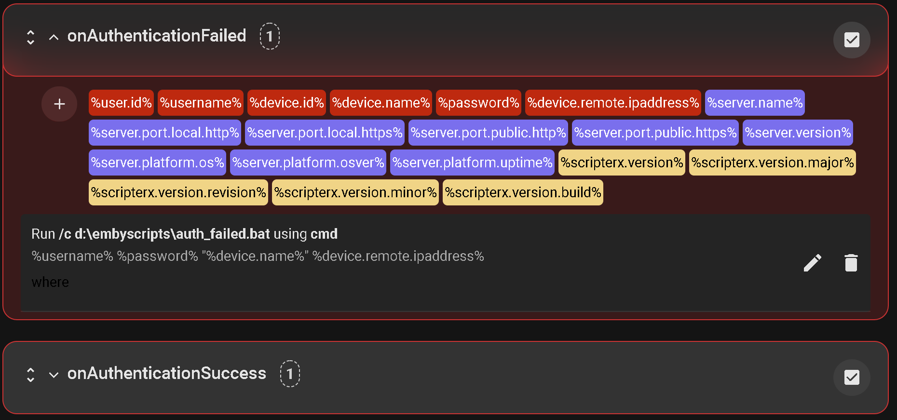
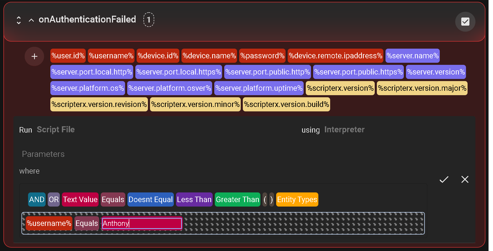
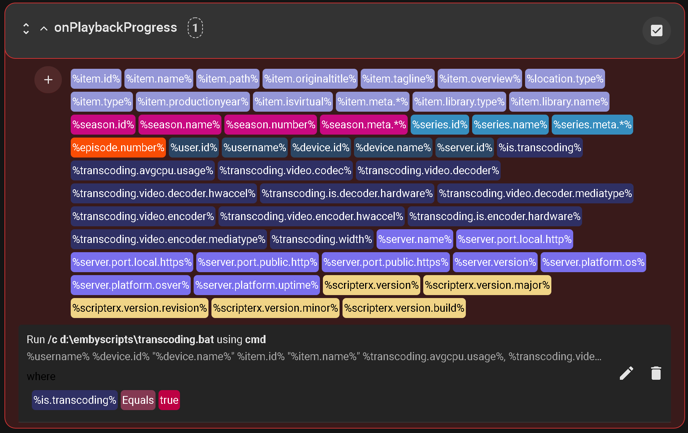
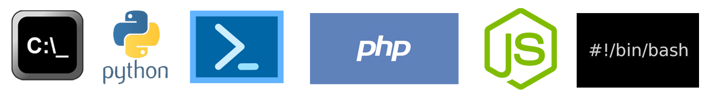

# Emby-ScripterX

Run custom external application or script (batch/bash/powershell/php/python/custom) on various events within the Emby Server.  

### Installation

#### Emby Server Plugin Catalog (recommended)

It is recommended that you install Emby Scripter-X via your Plugins catalog in your Emby Server Dashboard.  This will ensure your Emby Media Server will keep this plugin up to date every time we release a new version.

#### Manual Installation

To install Emby-ScripterX, simply copy the Emby-ScripterX.dll to your plugin directory and restart your Emby Server.   This plugin supports Windows, Linux and Mac OSX based installations.

### Configuration

#### Packages (new!)

ScripterX now has a packages implementation.  See the [packages wiki page](https://wiki.emby-scripterx.com/books/packages) for more information.

#### Conditions (new!)

ScripterX now supports conditions that are configurable by a simple & elegant drag-and-drop interface.  Conditional Operators are added as needed; so if you have any suggestions please feel free to suggest them via opening a GitHub ISSUE, we will tag it as a feature request!

Operator | Information | Example
-------- | ----------- | -------
AND | Javascript && equivalent | %token% Equals TextValue AND %token2% Doesnt Equal Othertextvalue
OR | Javascript &#7C;&#7C; equivalent  | %token% Equals TextValue OR %token2% Equals Othertextvalue
Text Value | Any text value, simply drag and drop, click on it and edit. | %item.name% Equals "Waynes World"
Equals | == Javascript equivalent | %token% Equals Movie (see Entity Types)
Doesnt Equal | != Javascript equivalent | %token% Doesnt Equal Episode (see Entity Types)
Less Than | < Javascript equivalent | %token% Less Than 5
Greater Than | > Javascript equivalent | %token% Greater Than 1998
( | Open bracket - used to group operators together (beginning) | (%token% Greater Than 1996) AND (%token% Less Than 1999) would yield results if the token value is between 1997-1998
) | Close bracket - used to group operators together (end) | (see above)
Entity Types | A dropdown box that allows you to select an entity type | Eg, Movie, Episode, Series, Season, Photo, etc

#### Screenshots (Dark Theme w/ Red)

#### Currently tested interpreters 

### Supported Events

Event | Tokens Available
----- | ----------------
On Authentication Failed | %user.id%, %username%, %device.id%, %device.name%, %password%, %device.remote.ipaddress%
On Authentication Success | %user.id%, %username%, %server.name%, %server.id%, %device.id%, %device.name%, %device.remote.ipaddress%
On Playback Start | %item.id%, %item.name%, %item.path%, %item.originaltitle%, %item.tagline%, %item.overview%, %location.type%, %item.type%, %item.productionyear%, %item.isvirtual%, %item.meta.?%, %item.library.type%, %item.library.name%, %season.id%, %season.name%, %season.number%, %season.meta.?%, %series.id%, %series.name%, %series.meta.?%, %episode.number%, %user.id%, %username%, %device.id%, %device.name%, %server.id%
On Playback Stopped | %item.id%, %item.name%, %item.path%, %item.originaltitle%, %item.tagline%, %item.overview%, %location.type%, %item.type%, %item.productionyear%, %item.isvirtual%, %item.meta.?%, %item.library.type%, %item.library.name%, %season.id%, %season.name%, %season.number%, %season.meta.?%, %series.id%, %series.name%, %series.meta.?%, %episode.number%, %user.id%, %username%, %device.id%, %device.name%, %server.id%
On Playback Progress | %item.id%, %item.name%, %item.path%, %item.originaltitle%, %item.tagline%, %item.overview%, %location.type%, %item.type%, %item.productionyear%, %item.isvirtual%, %item.meta.?%, %item.library.type%, %item.library.name%, %season.id%, %season.name%, %season.number%, %season.meta.?%, %series.id%, %series.name%, %series.meta.?%, %episode.number%, %user.id%, %username%, %device.id%, %device.name%, %server.id%, %is.transcoding%, %transcoding.avgcpu.usage%, %transcoding.video.codec%, %transcoding.video.decoder%, %transcoding.video.decoder.hwaccel%, %transcoding.is.decoder.hardware%, %transcoding.video.decoder.mediatype%, %transcoding.video.encoder%, %transcoding.video.encoder.hwaccel%, %transcoding.is.encoder.hardware%, %transcoding.video.encoder.mediatype%, %transcoding.width%
On Session Started | %user.id%, %username%, %device.id%, %device.name%, %server.id%
On Session Ended | %user.id%, %username%, %device.id%, %device.name%, %server.id%
On Media Item Added | %item.id%, %item.name%, %item.path%, %item.originaltitle%, %item.tagline%, %item.overview%, %location.type%, %item.type%, %item.productionyear%, %item.isvirtual%, %item.meta.?%, %item.library.type%, %item.library.name%, %photo.album.name%, %photo.altitude%, %photo.longitude%, %photo.latitude%, %photo.aperture%, %photo.camera.make%, %photo.camera.model%, %photo.exposuretime%, %photo.focallength%, %photo.iso%, %photo.shutterspeed%, %photo.software%, %season.id%, %season.name%, %season.number%, %season.meta.?%, %series.id%, %series.name%, %series.meta.?%, %episode.number%
On Media Item Added Complete | %item.id%, %item.name%, %item.path%, %item.originaltitle%, %item.tagline%, %item.overview%, %location.type%, %item.type%, %item.productionyear%, %item.isvirtual%, %item.meta.?%, %item.library.type%, %item.library.name%, %photo.album.name%, %photo.altitude%, %photo.longitude%, %photo.latitude%, %photo.aperture%, %photo.camera.make%, %photo.camera.model%, %photo.exposuretime%, %photo.focallength%, %photo.iso%, %photo.shutterspeed%, %photo.software%, %season.id%, %season.name%, %season.number%, %season.meta.?%, %series.id%, %series.name%, %series.meta.?%, %episode.number%
On Media Item Updated | %item.id%, %item.name%, %item.path%, %item.originaltitle%, %item.tagline%, %item.overview%, %location.type%, %item.type%, %item.productionyear%, %item.isvirtual%, %item.meta.?%, %item.library.type%, %item.library.name%, %photo.album.name%, %photo.altitude%, %photo.longitude%, %photo.latitude%, %photo.aperture%, %photo.camera.make%, %photo.camera.model%, %photo.exposuretime%, %photo.focallength%, %photo.iso%, %photo.shutterspeed%, %photo.software%, %season.id%, %season.name%, %season.number%, %season.meta.?%, %series.id%, %series.name%, %series.meta.?%, %episode.number%, %item.update.reason%
On Media Item Removed | %item.id%, %item.name%, %item.path%, %item.originaltitle%, %item.tagline%, %item.overview%, %location.type%, %item.type%, %item.productionyear%, %item.isvirtual%, %item.meta.?%, %item.library.type%, %item.library.name%, %photo.album.name%, %photo.altitude%, %photo.longitude%, %photo.latitude%, %photo.aperture%, %photo.camera.make%, %photo.camera.model%, %photo.exposuretime%, %photo.focallength%, %photo.iso%, %photo.shutterspeed%, %photo.software%, %season.id%, %season.name%, %season.number%, %season.meta.?%, %series.id%, %series.name%, %series.meta.?%, %episode.number%
On Scheduled Task | No tokens available yet
On Library Scan Completed | %scan.duration%, %scan.duration.days%, %scan.duration.hours%, %scan.duration.minutes%, %scan.duration.seconds%, %scan.library.name%
on Camera Image Uploaded | %device.id%, %device.name%, %device.last.username%, %device.last.activity%, %photo.album%, %photo.id%, %photo.name%, %photo.mime.type%
on Live TV Recording Start | %recording.id%, %recording.program.id%, %recording.channel.id%, %recording.date.start%, %recording.name%, %recording.path%, %recording.date.end%, %recording.episode.number%, %recording.episode.title%, %recording.prepadsecs%, %recording.postpadsecs%, %recording.season.number%, %recording.series.id%, %recording.show.id%, %recording.productionyear%, %recording.channel.affiliatecallsign%, %recording.channel.callsign%, %recording.channel.type%, %recording.channel.name%, %recording.channel.number%, %recording.tuner.friendlyname%, %recording.tuner.source%, %recording.tuner.count%, %recording.tuner.type%, %recording.tuner.url%, %recording.tuner.deviceid%
on Live TV Recording Ended | %recording.id%, %recording.program.id%, %recording.channel.id%, %recording.date.start%, %recording.name%, %recording.path%, %recording.date.end%, %recording.episode.number%, %recording.episode.title%, %recording.prepadsecs%, %recording.postpadsecs%, %recording.season.number%, %recording.series.id%, %recording.show.id%, %recording.productionyear%, %recording.channel.affiliatecallsign%, %recording.channel.callsign%, %recording.channel.type%, %recording.channel.name%, %recording.channel.number%, %recording.tuner.friendlyname%, %recording.tuner.source%, %recording.tuner.count%, %recording.tuner.type%, %recording.tuner.url%, %recording.tuner.deviceid%
on Scheduled Task Start | %task.category%, %task.name%, %task.id%
on Scheduled Task Ended | %task.id%, %task.category%, %task.result%, %task.name%, %task.start.time%, %task.end.time%, %task.start.time.utc%, %task.end.time.utc%
Global Server Tokens | %server.name%, %server.port.local.http%, %server.port.local.https%, %server.port.public.http%, %server.port.public.https%, %server.version%, %server.platform.os%, %server.platform.osver%, %server.platform.uptime%
Global ScripterX Tokens | %scripterx.version%, %scripterx.version.major%, %scripterx.version.minor%, %scripterx.version.revision%, %scripterx.version.build%

<strong>*</strong> Item meta IDs are retrieved via specifying the meta-provider ID in place of the ? (eg item.meta.imdb would yield the IMDB ID of that item

<strong>*</strong> %series.id%, %series.name%, %season.id%, %season.name% only available if media type is Episode.

<strong>*</strong> Some tokens may not be available to both Live TV recording events; eg on Start, %recording.path% is empty as there is no path until it's finished recording.

<strong>*</strong>Global Tokens are available within all actions in all events.

#### Community Script Interface
This functionality will be introduced over time, to ensure we are providing this functionality at a secure level.  The idea behind this interface is essentially giving the Emby Scripter-X community the ability to submit their own script ideas to be listed in the Scripts catalog, allowing other Emby Scripter-X users to utilise these scripts.  Currently, there is a little bit more design and thinking required to allow this to occur safely, but rest assured, it will be great.

