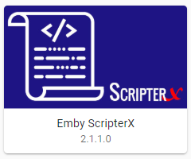
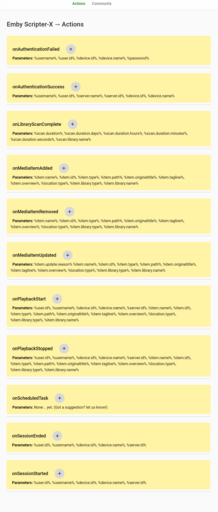
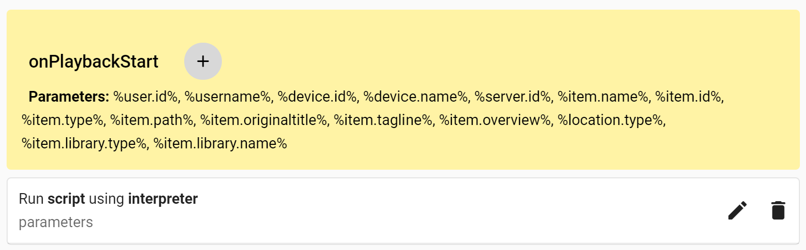
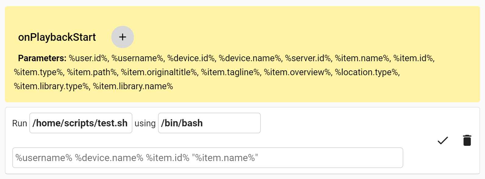
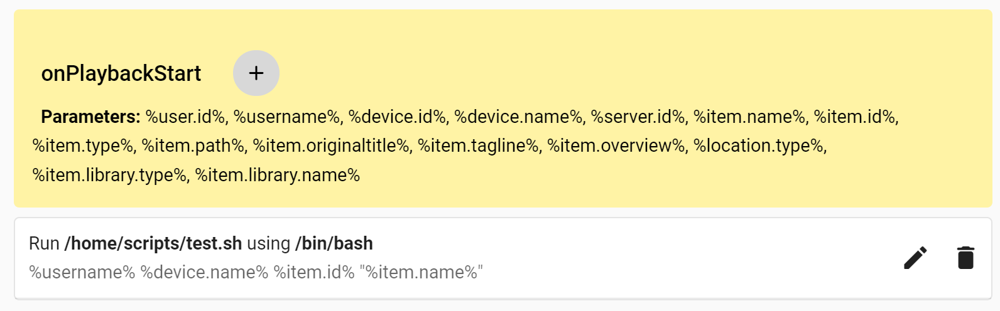
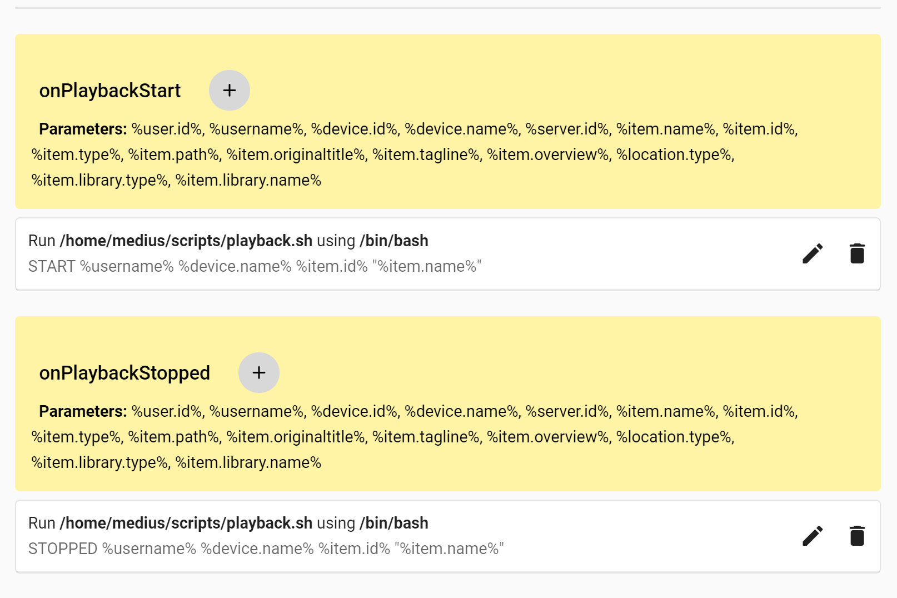
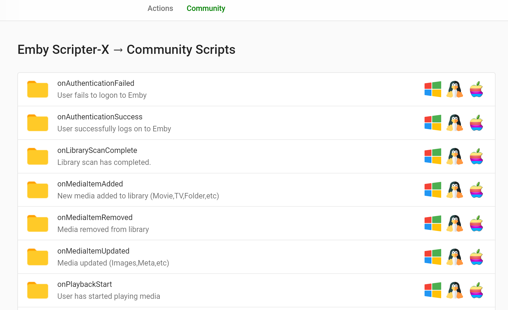

# Emby-ScripterX

Run custom external application or script (batch/bash) on various events within the Emby Server.  

### Installation
To install Emby-ScripterX, simply copy the Emby-ScripterX.dll to your plugin directory and restart your Emby Server.   This plugin supports Windows, Linux and Mac OSX based installations.

### Configuration

#### Actions Interface

#### Add new action to onPlaybackStart

#### Edit Action

#### Save Action

### Supported Events

Event | Tokens Available
----- | ----------------
On Authentication Failed | %username%, %user.id%, %device.id%, %device.name%, %password% 
On Authentication Success | %username%, %user.id%, %server.name%, %server.id%, %device.id%, %device.name% 
On Playback Start | %user.id%, %username%, %device.id%, %device.name%, %server.id%,%item.name%, %item.id%, %item.type%, %item.path%, %item.originaltitle%, %item.tagline%, %item.overview%, %location.type%, %item.library.type%, %item.library.name%, %series.id%, %series.name%, %season.id%, %season.name%
On Playback Stopped | %user.id%, %username%, %device.id%, %device.name%, %server.id%, %item.name%, %item.id%, %item.type%, %item.path%, %item.originaltitle%, %item.tagline%, %item.overview%, %location.type%, %item.library.type%, %item.library.name%, %series.id%, %series.name%, %season.id%, %season.name%
On Session Started | %user.id%, %username%, %device.id%, %device.name%, %server.id% 
On Session Ended | %user.id%, %username%, %device.id%, %device.name%, %server.id% 
On Media Item Added | %item.name%, %item.id%, %item.type%, %item.path%, %item.originaltitle%, %item.tagline%, %item.overview%, %location.type%, %item.library.type%, %item.library.name%, %series.id%, %series.name%, %season.id%, %season.name%
On Media Item Updated | %item.update.reason% %item.name%, %item.id%, %item.type%, %item.path%, %item.originaltitle%, %item.tagline%, %item.overview%, %location.type%, %item.library.type%, %item.library.name%, %series.id%, %series.name%, %season.id%, %season.name%
On Media Item Removed | %item.name%, %item.id%, %item.type%, %item.path%, %item.originaltitle%, %item.tagline%, %item.overview%, %location.type%, %item.library.type%, %item.library.name%, %series.id%, %series.name%, %season.id%, %season.name%
On Scheduled Task | No tokens available yet
On Library Scan Completed | %scan.duration%, %scan.duration.days%, %scan.duration.hours%, %scan.duration.minutes%, %scan.duration.seconds%, %scan.library.name%

Note: %series.id%, %series.name%, %season.id%, %season.name% only available if media type is Episode.

#### Working Example - Linux (onPlayback)

#### Community Script Interface
This functionality will be introduced over time, to ensure we are providing this functionality at a secure level.  The idea behind this interface is essentially giving the Emby Scripter-X community the ability to submit their own script ideas to be listed in the Scripts catalog, allowing other Emby Scripter-X users to utilise these scripts.  Currently, there is a little bit more design and thinking required to allow this to occur safely, but rest assured, it will be great.

