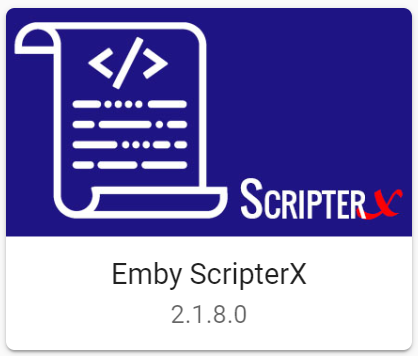
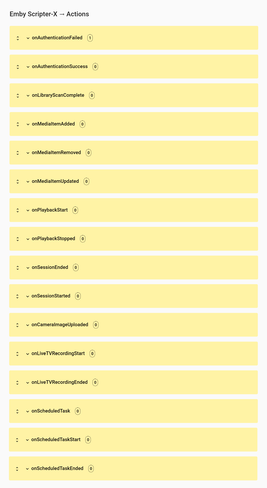
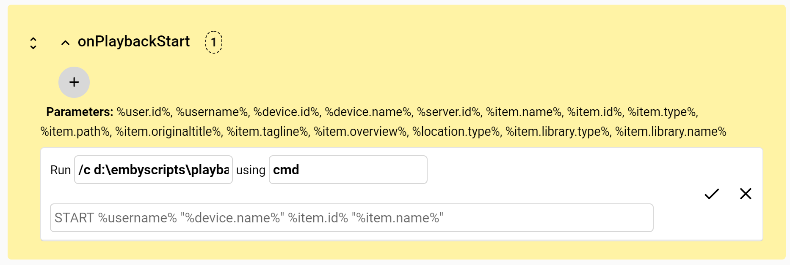
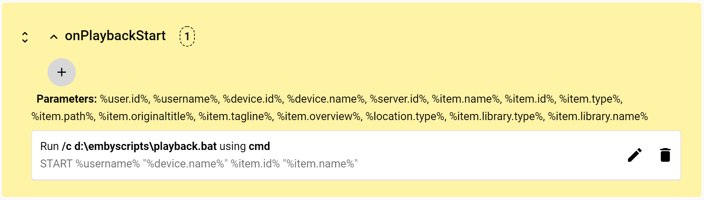

# Emby-ScripterX

Run custom external application or script (batch/bash/powershell/php/python/custom) on various events within the Emby Server.  

### Installation

#### Emby Server Plugin Catalog (recommended)

It is recommended that you install Emby Scripter-X via your Plugins catalog in your Emby Server Dashboard.  This will ensure your Emby Media Server will keep this plugin up to date every time we release a new version.

#### Manual Installation

To install Emby-ScripterX, simply copy the Emby-ScripterX.dll to your plugin directory and restart your Emby Server.   This plugin supports Windows, Linux and Mac OSX based installations.

### Configuration

#### Actions Interface

#### Edit Action

#### Save Action

### Supported Events

Event | Tokens Available
----- | ----------------
On Authentication Failed | %username%, %user.id%, %device.id%, %device.name%, %password% 
On Authentication Success | %username%, %user.id%, %server.name%, %server.id%, %device.id%, %device.name% 
On Playback Start | %user.id%, %username%, %device.id%, %device.name%, %server.id%,%item.name%, %item.id%, %item.type%, %item.path%, %item.originaltitle%, %item.tagline%, %item.overview%, %location.type%, %item.library.type%, %item.library.name%, %series.id%, %series.name%, %season.id%, %season.name%
On Playback Stopped | %user.id%, %username%, %device.id%, %device.name%, %server.id%, %item.name%, %item.id%, %item.type%, %item.path%, %item.originaltitle%, %item.tagline%, %item.overview%, %location.type%, %item.library.type%, %item.library.name%, %series.id%, %series.name%, %season.id%, %season.name%
On Session Started | %user.id%, %username%, %device.id%, %device.name%, %server.id% 
On Session Ended | %user.id%, %username%, %device.id%, %device.name%, %server.id% 
On Media Item Added | %item.name%, %item.id%, %item.type%, %item.path%, %item.originaltitle%, %item.tagline%, %item.overview%, %location.type%, %item.library.type%, %item.library.name%, %series.id%, %series.name%, %season.id%, %season.name%
On Media Item Updated | %item.update.reason% %item.name%, %item.id%, %item.type%, %item.path%, %item.originaltitle%, %item.tagline%, %item.overview%, %location.type%, %item.library.type%, %item.library.name%, %series.id%, %series.name%, %season.id%, %season.name%
On Media Item Removed | %item.name%, %item.id%, %item.type%, %item.path%, %item.originaltitle%, %item.tagline%, %item.overview%, %location.type%, %item.library.type%, %item.library.name%, %series.id%, %series.name%, %season.id%, %season.name%
On Scheduled Task | No tokens available yet
On Library Scan Completed | %scan.duration%, %scan.duration.days%, %scan.duration.hours%, %scan.duration.minutes%, %scan.duration.seconds%, %scan.library.name%
on Camera Image Uploaded | %device.id%, %device.name%, %device.last.username%, %device.last.activity%, %photo.album%, %photo.id%, %photo.name%, %photo.mime.type%
on Live TV Recording Start | %recording.id%, %recording.program.id%, %recording.channel.id%, %recording.date.start%, %recording.name%, %recording.path%, %recording.date.end%, %recording.episode.number%, %recording.episode.title%, %recording.prepadsecs%, %recording.postpadsecs%, %recording.season.number%, %recording.series.id%, %recording.show.id%, %recording.productionyear%, %recording.channel.affiliatecallsign%, %recording.channel.callsign%, %recording.channel.type%, %recording.channel.name%, %recording.channel.number%, %recording.tuner.friendlyname%, %recording.tuner.source%, %recording.tuner.count%, %recording.tuner.type%, %recording.tuner.url%, %recording.tuner.deviceid%
on Live TV Recording Ended | %recording.id%, %recording.program.id%, %recording.channel.id%, %recording.date.start%, %recording.name%, %recording.path%, %recording.date.end%, %recording.episode.number%, %recording.episode.title%, %recording.prepadsecs%, %recording.postpadsecs%, %recording.season.number%, %recording.series.id%, %recording.show.id%, %recording.productionyear%, %recording.channel.affiliatecallsign%, %recording.channel.callsign%, %recording.channel.type%, %recording.channel.name%, %recording.channel.number%, %recording.tuner.friendlyname%, %recording.tuner.source%, %recording.tuner.count%, %recording.tuner.type%, %recording.tuner.url%, %recording.tuner.deviceid%
on Scheduled Task Start | %task.category%, %task.name%, %task.id%
on Scheduled Task Ended | %task.id%, %task.category%, %task.result%, %task.name%, %task.start.time%, %task.end.time%, %task.start.time.utc%, %task.end.time.utc%

<strong>Note:</strong> %series.id%, %series.name%, %season.id%, %season.name% only available if media type is Episode. 
<strong>Also Note:</strong> Some tokens may not be available to both Live TV recording events; eg on Start, %recording.path% is empty as there is no path until it's finished recording.

#### Working Example - Linux (onPlayback)

#### Community Script Interface
This functionality will be introduced over time, to ensure we are providing this functionality at a secure level.  The idea behind this interface is essentially giving the Emby Scripter-X community the ability to submit their own script ideas to be listed in the Scripts catalog, allowing other Emby Scripter-X users to utilise these scripts.  Currently, there is a little bit more design and thinking required to allow this to occur safely, but rest assured, it will be great.

